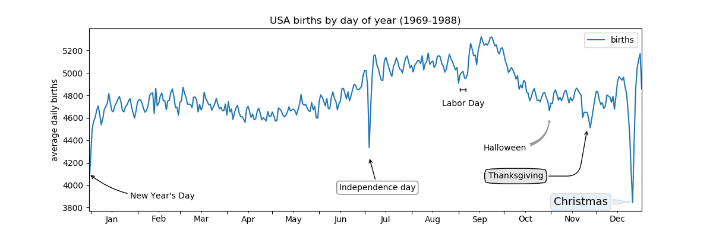

# Chapter 4: Visualization with Matplotlib
*Other libraries or plotting methods include: D3js, seaborn, ggplot, HoloViews, Altair*

## General Matplotlib Tips
Let's start of with a little bit of basic code, to set everything up right!

``` Python
import matplotlib as mpl
import matplotlib.pyplot as plt

# pick your style!
plt.style.use('classic') #others: 'seaborn-whitegrid'

# enabling mpl interactively in ipython:
%matplotlib

# basic plotting example
x = np.linspace(0, 10, 100)
fig = plt.figure()
plt.plot(x, np.sin(x), '-')
plt.plot(x, np.cos(x), '--');

plt.savefig('my_figure.png')

from IPython.display import Image
Image('my_figure.png')
```

## Two interfaces for the Price of One

Getting figures containing two plots is relatively easy with matplotlib, but there are two face to do it. With the MATLAB-Style interface and the Object-oriented interface.

Where the object-oriented is preferable if plots get more complicated since you're able to edit multiple plots afterwards, while the MATLAB-style is more or less 'permanent'.

### MATLAB-style interface
``` Python
plt.figure() #create a plotting figure

plt.subplot(2,1,1) #(rows, columns, panel number)
plt.plot(x, np.sin(x))

plt.subplot(2,1,2)
plt.plot(x, np.cos(x))
```

### Object-oriented interfaces
``` Python
# First create a grid of plots
# ax will be an array of two Axes objects
fig, ax = plt.subplots(2)

# Call plot() method on appropriate objects
ax[0].plot(x, np.sin(x))
ax[1].plot(x, np.cos(x));
```

## Simple line plots
Again there are two ways to plot a simple graph with matplotlib, and guess what it's easier than plotting two figures.

``` Python
#object oriented
plt.style.use('seaborn-whitegrid')

fig = plt.figure()
ax = plt.axes()

ax.plot(x, np.sin(x))

#matlab-Style
plt.plot(x, np.sin(x))
plt.plot(x, np.cos(x))
```

### Adjusting the Plot: Line Colors and Style

Adjusting the line colors can be done in several ways.

``` Python
In[6]:
plt.plot(x, np.sin(x - 0), color='blue')          # Specify color by name
plt.plot(x, np.sin(x - 1), color='g')             # short color code (rgbcmyk)
plt.plot(x, np.sin(x - 2), color='0.75')          # Grayscale between 0 and 1
plt.plot(x, np.sin(x - 3), color='#FFDD44')       # Hex code (RRGGBB from 00 to FF)
plt.plot(x, np.sin(x - 4), color=(1.0,0.2,0.3))   # RGB tuple, values 0 and 1
plt.plot(x, np.sin(x - 5), color='chartreuse');   # all HTML color names supported
```

Similarly you can adjust the line style using the linestyle keyword.

``` Python
plt.plot(x, x+0, linestyle='solid')
plt.plot(x, x+1, linestyle='dashed')
plt.plot(x, x+2, linestyle='dashdot')
plt.plot(x, x+3, linestyle='dotted');

# For short you can use the following codes:
plt.plot(x, x + 4, linestyle='-')   # solid
plt.plot(x, x + 5, linestyle='--')  # dashed
plt.plot(x, x + 6, linestyle='-.')  # dashdot
plt.plot(x, x + 7, linestyle=':')   # dotted
```

If you're really the stylish type these linestyle and color codes can be combined.

``` Python
plt.plot(x, x + 0, '-g')    # solid green
plt.plot(x, x + 1, '--c')   # dashed cyan
plt.plot(x, x + 2, '-.k')   # dashdot black
plt.plot(x, x + 3, ':r')    # dotted red
```

### Adjusting the Plot: Axes Limits

Adjusting the axes, adding labels, adding a legend is all done in a very easy fashion with matplotlib. The following codes shows how to do several of these things.

``` Python
plt.xlim(-1,1)
plt.ylim(-1.5,1.5)

plt.axis([xmin, xmax, ymin, ymax])
plt.axis('tight')
plt.axis('equal')

plt.title('A Sine Curve')
plt.xlabel('x')
plt.ylabel('sin(x)')

plt.plot(x, np.sin(x), '-g', label='sin(x)')
plt.plot(x, np.cos(x), ':b', label='cos(x)')
plt.legend()
```

In an object oriented plot everything is done in a similar fashion:

``` python
ax = plt.axes()

plt.plot() = ax.plot()
plt.legend() = ax.legend()
plt.xlabel() = ax.set_xlabel()
plt.ylabel() = ax.set_ylabel()
plt.xlim() = ax.set_xlim()
plt.ylim() = ax.set_ylim()
plt.title() = ax.set_title()

ax = plt.axes()
ax.plot(x, np.sin(x))

# Setting all options all at once:
ax.set( xlim=(0, 10), ylim=(-10,10),
        xlabel = 'x', ylabel='sin x'
        title = 'Sinus of the x'
      )
```

In the above plots we've taken a lot of (100) data points so all the Sine lines look pretty smooth. But something is going on under the hood. It actually making a scatterplot and chosing a default symbol value '-' to connect the dots.

### Simple Scatter Plots

There are several nice markers you can use to scatter you data among a plot:

``` Python
rng = np.random.RandomState(0)
markers = ['o', '.', ',', 'x', '+', 'v', '^', '<', '>', 's', 'd']

for marker in markers:
  plt.plot(rng.rand(5), rng.rand(5), marker,
  label = "marker = {0}".format(marker))

plt.legend()
plt.xlim(0, 1.8)
```

Colors and markers can be combined!

``` Python
plt.plot(x, y, '-ok'); # line (-), circle marker (o), color black (k)
```

And plots can be tuned of course:

``` Python
plt.plot(x, y, color = 'gray'
marker = 'p', markersize = 15,
linewidth = 4,
markerfacecolor = 'white'
markeredgecolor = 'grey'
markeredgewidth = '2'
)
```


### Scatter Plots with plt.scatter

``` Python
plt.scatter(x, y, marker = 'o')
```

The primary difference between `plt.plot` and `plt.scatter` is that with plt.scatter each individual point (size, face, color, edge color, etc.) can be individually controlled or mapped to data.

``` Python
rng = np.random.RandomState(0)
x = rng.randn(100)
y = rng.randn(100)

sizes = 1000 * rng.rand(100)
colors = rng.rand(100)

plt.scatter(x, y, c = colors, s = sizes, alpha = 0.3, cmap = 'viridis')
plt.colorbar()
```


``` Python
from sklearn.datasets import load_iris
iris = load_iris()

features = iris.data.T

plt.scatter(features[0], features[1], alpha = 0.2,
s=100 * features[3], c = iris.target, cmap='viridis')
plt.xlabel(iris.feature_names[0])
plt.ylabel(iris.feature_names[1])

```


## Visualizing Errors

Some variables are not really certain that's why the called variables. Sometime we can say a variable has a value x with max error dx. Visualising values with error rates can be done with:

``` Python
plt.errorbar(x, y, error = dy, fmt = 'o', color = 'black', ecolor = 'lightgray', elinewidth = 2, capsize = 3)
```

There are a lot of other ways to plot error bars. Horizontal ones, `plt.xerr()`, one sided ones and a ton of other variants. See docstring of plt.errorbar.

Now if you want to visualize an error area in a line plot. One can also use plt.fill_between(). Let us define a Gaussian Proces Regression first.

``` Python
from sklearn.gaussian_process import GaussianProcess

# define the model and draw some data
model = lambda x: x * np.sin(x)
xdata = np.array([1,3,5,6,8])
ydata = model(xdata)

# Compute the Gaussian Process fit
gp = GaussianProcess(corr = 'cubic', theta0 = 1e-2, thetaL = 1e-4, thetaU = 1E-1, random_start = 100)
gp.fit(xdata[:, np.newaxis], ydata)

xfit = np.linspace(0, 10, 1000)
yfit, MSE = gp.predict(xfit[:, np.newaxis], eval_MSE = True)
dyfit = 2 * np.sqrt(MSE)

# Visualize the result
plt.plot(xdata, ydata, 'or')
plt.plot(xfit, yfit, '-', color = 'gray')

plt.fill_between(xfit, yfit-dy, yfit+dy, color = 'lightgray', alpha = 0.2)
```

## Visualizing three dimensional data

So far we've only been visualizing two dimensional data, which is rather easy and also a tad boring. Visualizing three dimensional data is a lot more fun, and one way to do it via Contour Plots!

We'll first define a three dimensial function:

``` Python
def f(x,y):
  return np.sin(x) ** 10 + np.cos(10 + y * x) * np.cos(x)

x = np.linspace(0, 5, 50)
y = np.linspace(0, 5, 40)

X, Y = np.meshgrid(x,y) # meshgrid creates a 2 dimensional grid of two, one dimensional vectors. So in this
                        # case we have a grid of 2000 points with x-values x, and y-values y

Z = f(X, Y)

plt.contour(X, Y, Z, 20, cmap = 'RdGy')
plt.contourf(X, Y, Z, 50, cmap = 'RdGy')

```

`plt.contour` and `plt.contourf` are great, but we can also visualize it a third way with `plt.imshow`. Here we can call a function and plot it on a surface.

``` Python
plt.imshow(Z, extent=[0,5,0,5], origin = 'lower', cmap = 'RdGy')
```

Where extent defines the grid and origin defines a regular x, y grid.

We can also combine the two with the super awesome `plt.clabel()`, to get an epic picture! Like this:

``` Python
contours = plt.contour(X, Y, Z, 5, color='black')
plt.clabel(contours, inline = True, fontsize = 8)

plt.imshow(Z, extent = [0,5,0,5], origin ='lower', cmap = 'RdGy', alpha= 0.5)
```

The combinations of all above functions give you endless ways to create beautiful 2 dimensional plots of 3 dimensional data!

## Histograms, Binnings, and Density

Data is, in almost all cases, not just data. It probably has a distribution of some sort. Plotting distributions is done very easily with `plt.hist()`. Let's show this with some code.
``` Python
import numpy as np; import pandas as pd; import matplotlib.pyplot as plt; matplotlib
data = np.random.randn(1000)

# easy hist:
plt.hist(data)

# customized Histograms
plt.hist(data, bins = 30, histtype = 'stepfilled', alpha = 0.5, color = 'steelblue', edgecolor = 'none')
```


The way the plot is structured with `histtype = 'stepfilled'` and `alpha = 0.3` is also a very nice way to visualize multiple histograms.

``` Python
x1 = np.random.normal(0, 0.8, 1000)
x2 = np.random.normal(-2, 1, 1000)
x3 = np.random.normal(3, 2, 1000)

kwargs = dict(bins = 40, histtype = 'stepfilled', alpha = 0.3, normed = True)

plt.hist(x1, **kwargs)
plt.hist2(x2, **kwargs)
plt.hist3(x3, **kwargs)
```


If you have no need to visualize your data, but still want to bin it, you can use the numpy function `np.histogram()`

``` Python
counts, edges = np.histogram(data, bins = 5)
```

## Two-Dimensional Histograms and Binnings

If we can create histograms in one dimension by diving the number line in to bins, we can create two dimensional histograms by dividing the data in two dimensional bins. Let start explaining this with a multivariate normal distribution.

### `plt.hist2d()`

``` Python
# defining multivariate normal distribution
mean = [0,0]
cov = [[1,1], [1,2]]
x, y = np.random.multivariate_normal(mean, cov, 10000).T

plt.hist2d(x, y, bins = 30, cmap = 'Blues')
cb = plt.colorbar()
cb.set_label('counts in bin')
```


### `plt.hexbin()`

We can also plot this using, not squared bins, but hexagons!

``` Python
plt.hexbin(x, y, gridsize = 30, cmap = 'Blues')
cb = plt.colorbar()
cb.set_label('counts in bin')
```


### `Kernel density estimation`

Another common method of evaluating densities in multiple dimensions is kernel density estimation (KDE).

``` Python
from scipy.stats import gaussian_kde

# fit an array of siz´[Ndim, Nsamples]
data = np.vstack([x,y])
kde = gaussian_kde(data)

# evaluate a regular grid
xgrid = np.linspace(-3.5, 3.5, 40)
ygrid = np.linspace(-6, 6, 40)

Xgrid, Ygrid = np.meshgrid(xgrid, ygrid)
Z = kde.evaluate(np.vstack([Xgrid.ravel(), Ygrid.ravel()]))

# Plot the result as an image
plt.imshow(Z.reshape(Xgrid.shape), origin = 'lower', aspect = 'auto',
    extent = '[-3.5, 3.5, -6, 6]', cmap ='Blues')

cb = plt.colorbar()
cb.set_label("density")
```


## Customizing Plot Legends

We already seen how to add a plot legend to a figure. For example like this:

``` Python
x = np.linspace(0,10,1000)
fig, ax = plt.subplots()

ax.plot(x, np.sin(x), '-b', label = 'Sine')
ax.plot(x, np.cos(x), '--r', label = 'Cosine')

ax.axis('equal')
leg = ax.legend()

# Removing the frame and moving it to the upper left corner
ax.legend(frameon = False, loc = 'upper left')
```


But there are several ways to alter this legend of course. In the above example we've removed the frame and shuffed it in the upper left corner. Or we can move it somewhere else and ad a new columns to our legend!

``` Python
ax.legend(frameon = False, loc = 'lower center', ncol = 2)
```


Or we can add a fancy ass box with:

``` Python
ax.legend(fancybox = True, framealpha = 1, shadow = True, borderpad = 1)
```


To specify what you want to show, just create a plot with a variable and specify like this:

``` Python
x = np.linspace(0,10,10000)
y = np.sin(x[:, np.newaxis] + np.pi * np.arange(0,2,0.5))
lines = plt.plot(x,y)

# the legend:
plt.legend(lines[:2], ['first', 'second'])
```


### Legend for size of points

While all these kind of legends are super great, what shows in your legend is still dependent on what shows in your graph. Now what if we want to have a legend with certain predefined objects? Like the size of a circle projects the size of the area of a city for example? How can we create a legend of that without having to show every circle size there is? Well, by creating an invisible plot! And making a legend from that plot:

``` Python
cities = pd.read_csv('data/california_cities.csv')
# Extract the data we're interested in
lat, lon = cities['latd'], cities['longd']
population, area = cities['population_total'], cities['area_total_km2']
# Scatter the points, using size and color but no label
plt.scatter(lon, lat, label=None,
                  c=np.log10(population), cmap='viridis',
                  s=area, linewidth=0, alpha=0.5)
plt.axis(aspect='equal')
plt.xlabel('longitude')
plt.ylabel('latitude')
plt.colorbar(label='log$_{10}$(population)')
plt.clim(3, 7)
# Here we create a legend:
# we'll plot empty lists with the desired size and label for area in [100, 300, 500]:
plt.scatter([], [], c='k', alpha=0.3, s=area,
                  label=str(area) + ' km$^2$')
plt.legend(scatterpoints=1, frameon=False,
                  labelspacing=1, title='City Area')
plt.title('California Cities: Area and Population')
```

Creating this awesomeness:


### Multiple legends

Now matplotlib doesn't allow multiple legends in an ordinary fashion. If you input a new legend in the regular way, it will overwrite the last one. But there is always a way. We can create a second legend by using the `add_artist()`

``` python
fig, ax = plt.subplots()
lines = []
x = np.linspace(0, 10, 1000)
styles = ['-', '--', '-.', ':']

for i in range(4):
  lines += ax.plot(x, np.sin(x - i * np.sin(x) / 2), styles[i], color = 'black')

plt.axis('equal')

ax.legend(lines[:2], ['Line A', 'Line B'], loc = 'upper right', frameon = False)

import Legend from matplotlib
leg = Legend(ax, lines[2:], ['Line C', 'Line D'], loc = 'lower right', frameon = False)
ax.add_artist(leg)
```


## Customizing Colorbars

Colorbars and colormaps are used for plotting legends and data with continous difference. Often adding a clear third dimension in a two-dimensional plot. Let's start of with an easy colorbar.

``` Python
x = np.linspace(0, 10, 1000)
I = np.sin(x) * np.cos(x[:, np.newaxis])

plt.imshow(I)
plt.colorbar()
```


But we can make it gray!

``` Python
plt.imshow(I, cmap = 'gray')
plt.colorbar()
```


Great stuff! Now there are alot of other colormaps besides these two. Try `plt.cm.<TAB>` to see them all. What color to choose to make your plot is dependent on a lot of things. Two fun articles with some great thoughts about coloring graphs are: [Ten Simple Rules for Better Figures](http://journals.plos.org/ploscompbiol/article?id=10.1371/journal.pcbi.1003833) or matplotlibs way of choosing colormaps: [interesting discussion](https://matplotlib.org/1.4.1/users/colormaps.html)

It's wise to used a dark to bright colorbar. So avoid `'jet'` or `'RdBu'`, because these colorbars are brightest in the middle. Showing them in `'gray'` will lose all information while homogeneous dark to bright bars don't have that issue.

### Color limits and extensions

Let's add some noise to the data.

``` Python
# make noise in 1% of the pixels
speckles = (np.random(I.shape)< 0.01)
I[speckles] = np.random.normal(0,3, np.count_nonzero(speckles))

plt.figure(figsize(10, 3.5))

plt.subplot(1,2,1)
plt.imshow(I, cmap = 'RdBu')
plt.colorbar()

plt.subplot(1,2,2)
plt.imshow(I, cmap = 'RdBu')
plt.colorbar(extend = 'both')         # extend show the viewer there are more colors than shown. (colorlimit != valuelimit)
plt.clim(-1,1)                        # set a limit so we can see!
```


### Discrete Colorbars

Above colorbars are all discrete, but sometimes it's alot clearer to define levels. Making a colormap discrete is done by calling the colormap with `plt.cm.get_cmap('Blues', 6)`.

``` Python
plt.imshow(I, cmap = plt.cm.get_cmap('Blues', 6))
plt.colorbar()
plt.clim(-1,1)
```


### Example: Handwritten Digits

A supercool example of using a colormap in practice is in image recognition. Let's start of with the easiest example "The Handwritten Digits" dataset. This dataset contains data in the form of arrays. These array represent a handwritten number by a number in 64 x 64 grid. Higher numbers are darker pixels, lower numbers are brighter pixels and 0 is white. Plotting all numbers with there 64 dimension can be a challenge, but we'll use a manifold to try it anyway.

``` Python
from sklearn.datasets import load_digits
digits = load_digits(n_class = 6)

fig, ax = plt.subplots(8,8, figsize = (6,6))
for i, axi in enumerate(ax.flat):
  axi.imshow(digits.images[i], cmap = 'binary')
  axi.set(xticks=[], yticks=[])
```


``` python
from sklearn.manifold import Isomap
iso = Isomap(n_components = 2)
projection = iso.fit_transform(digits.data)
```

Projecting 68 dimensional data on 2 dimensions.

``` Python
plt.scatter(projection[:, 0], projection[:, 1], lw=0.1, c=digits.target, cmap=plt.cm.get_cmap('cubehelix', 6))
plt.colorbar(ticks=range(6), label = 'digit value')
plt.clim(-0.5, 5.5)
```


## Multiple Subplots

Having multiple plots in one figure is awesome, and we've already seen a way to do this with `plt.subplots(1,2,1)`. This way you're only able to split your axis, but maybe you want some more options. Putting a graph in the top right for example!?

``` Python
ax1 = plt.axes()
ax2 = plt.axes([0.65, 0.65, 0.2, 0.2])
```


The key thing to remember is, one can define their own axes with `plt.axes([l, b, w, h])`. Remember: Left, Bottom, Width, Height!

This can be used to have two graphs kiss eachother at the top and bottom.

``` Python
fig = plt.figure()
ax1 = fig.axes([0.1,0.1,0.8,0.4], xticks =[], ylim = (-1.2,1.2))
ax2 = fig.axes([0.1,0.5,0.8,0.4], ylim = (-1.2,1.2))

x = np.linspace(0,10)
ax1.plot(np.sin(x))
ax2.plot(np.cos(x))

```


### Simple Grids of Subplots

A Simple grid can be made, once again with `plt.subplot(xgrid, ygrid, position)`. Let's show a small example.

``` Python
for i in range(1,7):
  plt.subplot(2,3,i)
  plt.text(0.5, 0.5, str((2,3,i)), fontsize =18, ha='center')
```

Where `plt.text(x,y,s,f,ha)` has x-input, y-input, a string, the fontsize and the horizontal alignment as input. Producting:


One can alter the width between the images with

``` Python
fig = plt.figure()
fig.subplots_adjust(hspace = 0.4, wspace = 0.4)

for i in range(1,7):
  plt.subplot(2,3,i)
  plt.text(0.5, 0.5, str((2,3,i)), fontsize =18, ha='center')
```

### `plt.subplots()`: The Whole Grid in One Go

``` Python
fig, ax = plt.subplots(2,3, sharex = 'col', sharey = 'row')

for i in range(2):
  for j in range(2):
    ax[i,j].text(0.5,0.5,str((i,j)),fontsize = 16, ha = 'center' )
```


Here we use the function `plt.subplots()` with arguments `sharex = 'col'` and `sharey = 'row'`, which specifies that plots among the columns can share the x axis, and among the rows they can share the y axis.

### `plt.GridSpec()`

Now with `plt.subplots()` one can create multiple subplots in a figure in one go. But these subplots are all the same size. We can define different sized subplots in the same figure by defining a grid with `plt.GridSpec()`

``` Python
# Defining the grid
grid = plt.GridSpec(2,3, wpace = 0.3, hspace = 0.3) #gridsize (2,3)

# Plotting on the grid
plt.subplot(grid[0,0])
plt.subplot(grid[0,1:])

plt.subplot(grid[1, :-1])
plt.subplot(grid[1, -1])
```


Bringing al of this together we can create triple histogram plots. Which are quite common and even included in seaborn.

``` Python
mean = [0,0]
cov = [[1,1],[1,2]]

x, y = np.random.multivariate_normal(mean, cov, 3000).T

grid = plt.GridSpec(4,4, wspace = 0.2, hspace = 0.2)

main_ax = plt.subplot(grid[:-1, 1:])
y_hist = plt.subplot(grid[:-1, 0], xticklabels =[], sharey = main_ax)
x_hist = plt.subplot(grid[-1, 1:], yticklabels = [], sharex = main_ax)

main_ax.plot(x,y, 'ok', markersize = 3, alpha = 0.2)
x_hist.hist(x, 40, histtype = 'stepfilled', orientation = 'vertical', color = 'gray')
y_hist.hist(y, 40, histtype = 'stepfilled', orientation = 'horizontal', color ='gray')

x_hist.invert_yaxis()
y_hist.invert_xaxis()
```


## Text and Annotation

In this section we'll explain how to add text and annotations to your plot. We'll revisit an old plot we've seen before, the births in the USA dataset.

``` Python
births = pd.read_csv('./static/data/births.csv')
quartiles = np.percentile(births['births'], [25, 50, 75])
mu, sig = quartiles[1], 0.74 * (quartiles[2] - quartiles[0])
births = births.query('(births > @mu - 5 * @sig) & (births < @mu + 5 * @sig)')
births['day'] = births['day'].astype(int)
births.index = pd.to_datetime(10000 * births.year + 100 * births.month + births.day, format='%Y%m%d')
births_by_date = births.pivot_table('births', [births.index.month, births.index.day])
births_by_date.index = [pd.datetime(2012, month, day)for (month, day) in births_by_date.index]

fig, ax = plt.subplots(figsize=(12, 4))
           births_by_date.plot(ax=ax);

# Add labels to the plot
style = dict(size=10, color='gray')
ax.text('2012-1-1', 3950, "New Year's Day", **style)
ax.text('2012-7-4', 4250, "Independence Day", ha='center', **style)
ax.text('2012-9-4', 4850, "Labor Day", ha='center', **style)
ax.text('2012-10-31', 4600, "Halloween", ha='right', **style)
ax.text('2012-11-25', 4450, "Thanksgiving", ha='center', **style)
ax.text('2012-12-25', 3850, "Christmas ", ha='right', **style)

# Label the axes
ax.set(title='USA births by day of year (1969-1988)',
      ylabel='average daily births')

# Format the x axis with centered month labels
ax.xaxis.set_major_locator(mpl.dates.MonthLocator())
ax.xaxis.set_minor_locator(mpl.dates.MonthLocator(bymonthday=15))
ax.xaxis.set_major_formatter(plt.NullFormatter())
ax.xaxis.set_minor_formatter(mpl.dates.DateFormatter('%h'));
```


### Transforms and Text position

There's a small subtilty in the way text annotations work. It takes the locations given in a certain graph (x, y) figure or axes and transforms them to the real figure on your screen. This is all under the hood, but in the future it might be convenient to know about it, if you want to add some rogue text on the boundary of a figure. Just specify what tranformation you want in `.text(transform = ax.transData)` or:

``` Python
fig, ax = plt.subplots(facecolor = 'lightgray')

# transform=ax.transData is the default, but we'll specify it anyway
ax.text(1, 5, ". Data: (1, 5)", transform=ax.transData)
ax.text(0.5, 0.1, ". Axes: (0.5, 0.1)", transform=ax.transAxes)
ax.text(0.2, 0.2, ". Figure: (0.2, 0.2)", transform=fig.transFigure);

# the shift to the second plot
ax.set_xlim(0, 2)
ax.set_ylim(-6, 6)
```


### Arrows and Annotation

Annotation with an arrow is ever better! So for this awesome way of annotating never use `plt.arrow()`, but `plt.annotate()`. This is because the formal is very weird to use and the latter has a lot more customisability. Let's take a look!

``` Python
fig, ax = plt.figure()
x = np.linspace(0, 20, 1000)

ax.plot(x, np.cos(x))
ax.axis('equal')

ax.annotate('local maximum', xy = (6,28,1), xytext = (10, 4), arrowprops = dict(facecolor = 'black', shrink = 0.05))

ax.annotate('local minimum', xy = (5 * np.pi, -1), xytext = (2, -6), arrowsprops = dict(arrowstyle = "->", connectionstyle = "angle3, angleA=0, angleB=-90"))
```


As you can see creating arrows is relatively easy. With `arrowsprops` you can change the arrows' features. Matplotlib has good documentation on this, but we'll show some examples.

``` Python
fig, ax = plt.subplots(figsize=(12, 4))
births_by_date.plot(ax=ax)

# Add labels to the plot
ax.annotate("New Year's Day", xy=('2012-1-1', 4100),  xycoords='data',
            xytext=(50, -30), textcoords='offset points',
            arrowprops=dict(arrowstyle="->",
                            connectionstyle="arc3,rad=-0.2"))
ax.annotate("Independence Day", xy=('2012-7-4', 4250),  xycoords='data',
            bbox=dict(boxstyle="round", fc="none", ec="gray"),
xytext=(10, -40), textcoords='offset points', ha='center',
arrowprops=dict(arrowstyle="->"))

ax.annotate('Labor Day', xy=('2012-9-4', 4850), xycoords='data', ha='center',
xytext=(0, -20), textcoords='offset points')

x.annotate('', xy=('2012-9-1', 4850), xytext=('2012-9-7', 4850),
xycoords='data', textcoords='data',
arrowprops={'arrowstyle': '|-|,widthA=0.2,widthB=0.2', })

ax.annotate('Halloween', xy=('2012-10-31', 4600),  xycoords='data',
xytext=(-80, -40), textcoords='offset points',
arrowprops=dict(arrowstyle="fancy",
                fc="0.6", ec="none",
                connectionstyle="angle3,angleA=0,angleB=-90"))

ax.annotate('Thanksgiving', xy=('2012-11-25', 4500),  xycoords='data',
xytext=(-120, -60), textcoords='offset points',
bbox=dict(boxstyle="round4,pad=.5", fc="0.9"),
arrowprops=dict(arrowstyle="->",
                connectionstyle="angle,angleA=0,angleB=80,rad=20"))

ax.annotate('Christmas', xy=('2012-12-25', 3850),  xycoords='data',
 xytext=(-30, 0), textcoords='offset points',
 size=13, ha='right', va="center",
 bbox=dict(boxstyle="round", alpha=0.1),
 arrowprops=dict(arrowstyle="wedge,tail_width=0.5", alpha=0.1));

# Label the axes
ax.set(title='USA births by day of year (1969-1988)',
ylabel='average daily births')

# Format the x axis with centered month labels
ax.xaxis.set_major_locator(mpl.dates.MonthLocator())
ax.xaxis.set_minor_locator(mpl.dates.MonthLocator(bymonthday=15))
ax.xaxis.set_major_formatter(plt.NullFormatter())
ax.xaxis.set_minor_formatter(mpl.dates.DateFormatter('%h'));
ax.set_ylim(3600, 5400);
```


