# Chapter 5: Machine Learning

The term “machine learning” is sometimes thrown around as if it is some kind of magic pill: apply machine learning to your data, and all your problems will be solved! As you might expect, the reality is rarely this simple. While these methods can be incredibly powerful, to be effective they must be approached with a firm grasp of the strengths and weaknesses of each method, as well as a grasp of general concepts such as *bias* and *variance*, *overfitting* and *underfitting*, and more.

## Other Resources Machine Learning in Python

To learn more about machine learning in Python, I’d suggest some of the following resources:

[The Scikit-Learn website](http://scikit-learn.org)
The Scikit-Learn website has an impressive breadth of documentation and exam‐ ples covering some of the models discussed here, and much, much more. If you want a brief survey of the most important and often used machine learning algo‐ rithms, this website is a good place to start.

**SciPy, PyCon, and PyData tutorial videos**
Scikit-Learn and other machine learning topics are perennial favorites in the tutorial tracks of many Python-focused conference series, in particular the PyCon, SciPy, and PyData conferences. You can find the most recent ones via a simple web search.

[Introduction to Machine Learning with Python](http://bit.ly/intro-machine-learning-python)
Written by Andreas C. Mueller and Sarah Guido, this book includes a fuller treat‐ ment of the topics in this chapter. If you’re interested in reviewing the fundamen‐ tals of machine learning and pushing the Scikit-Learn toolkit to its limits, this is a great resource, written by one of the most prolific developers on the Scikit-Learn team.

[Python Machine Learning](http://bit.ly/2eLDR7c)
Sebastian Raschka’s book focuses less on Scikit-Learn itself, and more on the breadth of machine learning tools available in Python. In particular, there is some very useful discussion on how to scale Python-based machine learning approaches to large and complex datasets.

## General Machine Learning
Of course, machine learning is much broader than just the Python world. There are many good resources to take your knowledge further, and here I highlight a few that I have found useful:

[Machine Learning](https://www.coursera.org/learn/machine-learning)
Taught by Andrew Ng (Coursera), this is a very clearly taught, free online course covering the basics of machine learning from an algorithmic perspective. It assumes undergraduate-level understanding of mathematics and programming, and steps through detailed considerations of some of the most important machine learning algorithms. Homework assignments, which are algorithmically graded, have you actually implement some of these models yourself.

[Pattern Recognition and Machine Learning](http://www.springer.com/us/book/9780387310732)
Written by Christopher Bishop, this classic technical text covers the concepts of machine learning discussed in this chapter in detail. If you plan to go further in this subject, you should have this book on your shelf.

[Machine Learning: A Probabilistic Perspective](https://mitpress.mit.edu/books/machine-learning-0)
Written by Kevin Murphy, this is an excellent graduate-level text that explores nearly all important machine learning algorithms from a ground-up, unified probabilistic perspective.

These resources are more technical than the material presented in this book, but to really understand the fundamentals of these methods requires a deep dive into the mathematics behind them. If you’re up for the challenge and ready to bring your data science to the next level, don’t hesitate to dive in!

# Machine Learning

With Machine Learning one can learn a computer to find patterns in data. And make predictions on these pattern for new not yet found data. One of the most famous examples of data where machine learning can be applied is the iris dataset, found in the seaborn library.

``` python
import seaborn as sns
sns.set()
iris = sns.load_dataset('iris')

sns.pairplot(iris, hue = 'species', size = 1.5)
```

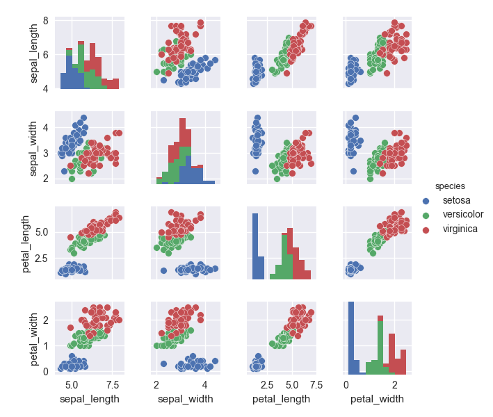

This iris dataset contains the features of the plants, like the length and width of their petal. And it also contains it's species. With the features known one can make predictions on what kind of species of iris the plant is. This is the essence of machine learning.

Finding patterns in a features matrix on a target array in a training set. To make superb predictions in a target set. Since we have a training and a test set, this is called supervised learning. We're learning the algorithm what is good and bad. The other part of machine learning is unsupervised machine learning where it doesn't have a target vector and is just asked to find patterns.

## Scikit Learn

A great machine learning library is Scikit Learn, or sklearn in short. Using this library of API always goes about in similar fashion.

* Pick a model
* Define a features matrix X and target vector y
* Fit the model to your data by calling the `.fit()` method.
* Apply the model to new data, by call the `.predict()`
* Evaluate the model

### Supervised Learning Example: Simple linear regression

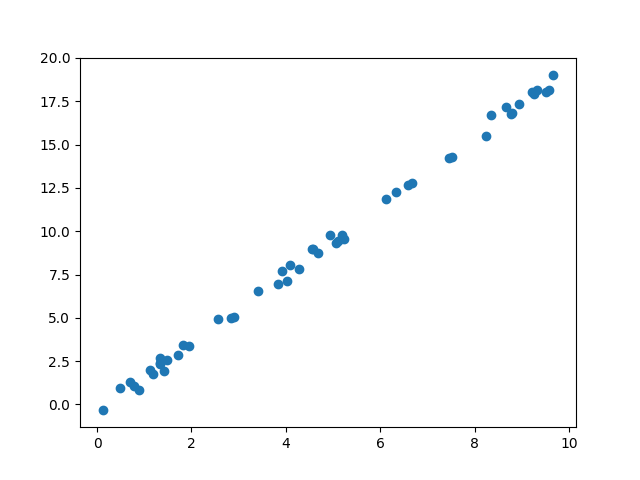

Let's start of with a small dataset configured with the following code. There is a linear correlation between the x and y data (axis) for all points in the dataset. The goal of linear regression is to build a model which simulates this correlation so we can make predictions on datapoints not in the original dataset.

``` python
# importing the linear regression module
from sklearn.linear_model import LinearRegression

# Creating some data with a linear correlation
rng = np.random.RandomState(40)
x = 10 * rng.rand(50)
y = 2 * x + 1 - rng.rand(50)

# Features matix X has to be a matrix
X = x[:, np.newaxis]

# Initiate a linear model
model = LinearRegression(fit_intercept = True)

# Fit the model to our data
model.fit(X,y)

# Predict values not in X
xfit = np.linspace(-1, 11)
Xfit = xfit[:, np.newaxis]

yfit = model.predict(Xfit)

# Plot the results
plt.scatter(x,y)
plt.plot(xfit, yfit);
```

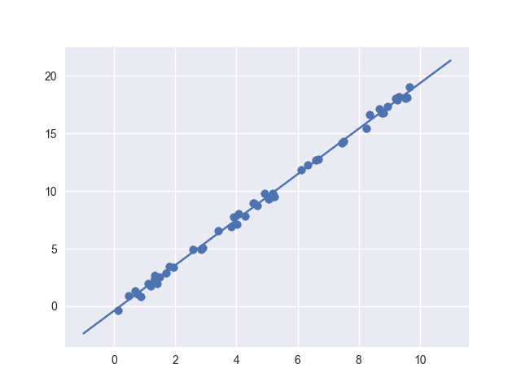

With our model being represented with the blue line. Which has a intercept and coefficient.

``` python
In [27]: model.coef_
Out[27]: array([1.9755672])

In [28]: model.intercept_
Out[28]: -0.3853261759566511
```

And we've build our first Machine Learning Model! Oh my god!

### Supervised Learning Example: Iris Classification

After building out first model, we're (of course) very excited to build our second model. But for this example we should use something more exciting and make real predictions! Let's go back to our trusty iris dataset and see if we can build a model on one part of the dataset and with this model make predictions on the other part of data. Later we can compare results and see how good the model actually is.

For this we're going to use a very simple classification model called Gaussian Naive Bayes.

``` python
# Load the iris dataset and define the matrix of features and target vector
iris = sns.load_dataset('iris')
X_iris = iris.drop('species', axis = 1)
y_iris = iris['species']

# import function that automatically splits the data in a training and a test set.
from sklearn.cross_validation import train_test_split
X_train, X_test, y_train, y_test = train_test_split(X_iris, y_iris)

# import a simple classification model
from sklearn.naive_bayes import GaussianNB
model = GaussianNB()

# train the model
model.fit(X_train, y_train)

# fit the model to the test-set
y_model = model.predict(X_test)

# evaluate the model
from sklearn.metrics import accuracy_score
accuracy_score(y_model, y_test)
Out[69]: 0.9473684210526315
```

Already getting a whopping 95% accuracy!!

### Unsupervised Learning Example: Dimensionality Reduction

Now since we've already seen the iris dataset a couple of times, we're not going in to much dept. The iris dataset contains four dimensions in the feature space: `sepal_length  sepal_width  petal_length  petal_width` and of course it's target vector of one dimension `species`. Visualising this 4/5 dimensional data in a two dimensional plot will be very hard. But with dimensionality reduction this is possible.

We'll compress the four dimensions in two dimensions trying to maintain as much of the variance of the data as possible with Principle Component Analysis or PCA for short.

``` python
import seaborn as sns
iris = sns.load_dataset('seaborn')
X_iris = iris.drop('species', axis = 1)
y_iris = iris['species']

from sklearn.decomposition import PCA
model = PCA(n_components = 2)
model.fit(X_iris)
X_2d = model.transform(X_iris)

iris['PCA1'] = X_2d[:, 0]
iris['PCA2'] = X_2d[:, 1]

sns.lmplot("PCA1", "PCA2", data = iris, hue = 'species', fit_reg = False)
```

Giving us the nice two dimensional plot with a third dimension of species on the colors.

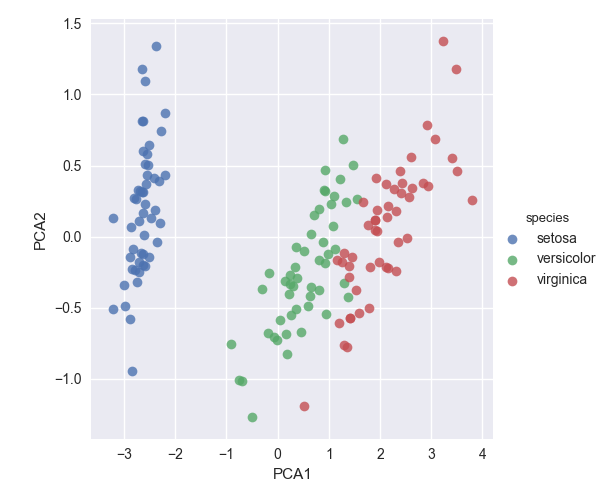

### Unsupervised Learning Example: Iris Clustering

Next we'll try a clustering algorithm on the data. A clustering algorithm tries to find distict groups of data without having a target vector. For the iris dataset we'll use the Gaussian Mixture Model or GMM for short. A GMM tries to model the data as a collection of Gaussian blobs.

``` python
from sklearn.mixture import GMM
model = GMM(n_components = 3, covariance_type = 'full')
model.fit(X_iris)
y_gmm = model.predict(X_iris)   #predicting y labels

iris['cluster'] = y_gmm
sns.lmplot("PCA1", "PCA2", data = iris, hue = 'species', col = 'cluster', fit_reg = False)
```

This way we've told an algorithm to find a model that splits the data in three distinct groups without telling the algorithm anything about the target vector `species`. Because we've splitted the plot among the clusters we can very well see how well the model actually did. We can see that it was hundred percent accurate on find the cluster 0 species, while there is some mixture between the 1st and 2nd cluster. Supercool stuff!!

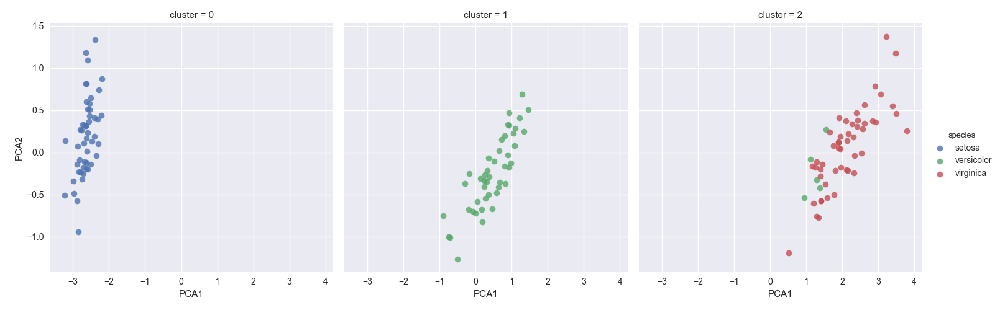

### Application: Exploring Handwritten Digits

Let's explore what we've learned so far, and apply it to a cool problem working with image recognition. We extract a dataset called digits. Containing 1797 handwritten digits.

``` python
from sklearn.datasets import load_digits
digits = load_digits()
```

After some exploration we see 8 x 8 arrays of dark intensity. We can visualize these images using `plt.imshow()`. Let's write some code to visualize the first 100 images.

``` python
fig, ax = plt.subplots(10,10, figsize = (8,8), subplot_kw = {'xticks': [], 'yticks': []}, gridspec_kw = dict(hspace = 0.1, wspace = 0.1))
for i, ax in enumerate(ax.flat):
  ax.imshow(digits.images[i], cmap = 'binary', interpolation = 'nearest')
  ax.text(0.05,0.05, str(digits.target[i]), transform = ax.transAxes, color = 'green' )
```

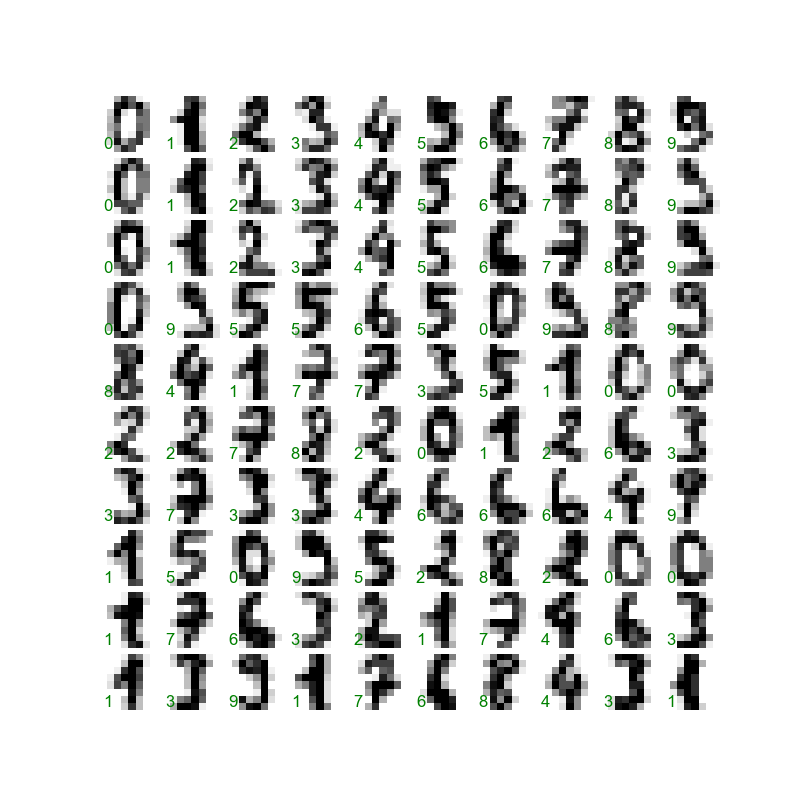

Now we want to build an algorithm which can predict what number is written. To do this we'll have to flatten the 8 x 8 array to 64 features and have the target array be the target array...

``` python
X = digits.data
y = digits.target
```

### Unsupervised Learning: Dimensionality Reduction

Let's try to shrink 64 dimensions in 2 dimensions!! Can we do it?

``` python
from sklearn.manifold import Isomap
iso = Isomap(n_components = 2)
iso.fit(X)
data_projected = iso.transform(X)
```

Now that we've transformed the data to two dimensions we can visualize the different numbers by coloring them with the targets.

``` python
plt.scatter(data_projected[:,0], data_projected[:,1], c = digits.target, edge_color = 'none', alpha = 0.5, cmap = plt.cm.get_cmap('nipy_spectral', 10))
plt.colorbar(label = 'digitlabel', ticks = range(10))
plt.clim(-0.5, 9.5)
```

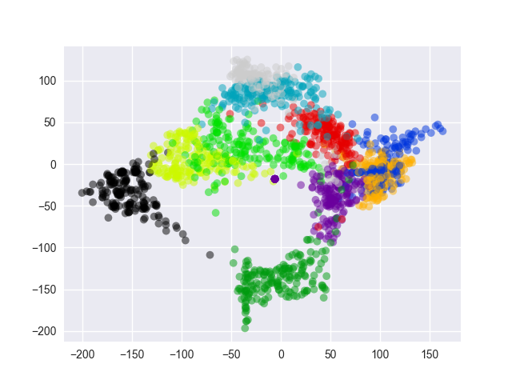


Gives us an image where we can clearly see the different numbers being clustered together. We also get some insights on what numbers are similar. We can see 0 and 1 are almost opposites (makes sense) if you look at them. And for example 0, 6 and 8 are quite similar.

Let's see if we can build an algorithm that classifies all the different handwritten digits among their correct number.

### Classification on Digits

Note: There is a small mistake in the book and we have to define the features and target vector as a dataframe and a series. This way we can keep track of the labels and see how good the model is actually doing.

We'll use the Gaussian Naive Bayes like we've done before. First we have to define the training and the test set. `sklearn` works really well with pandas so defining labels on the dataframe will carry on to `train_test_split`.

``` python
X = pd.DataFrame(X)
y = pd.Series(y)

from sklearn.cross_validation import train_test_split
X_train, X_test, y_train, y_test = train_test_split(X, y)

# train the model
from sklearn.naive_bayes import GaussianNB()
model = GaussianNB()
model.fit(X_train, y_train)
y_pred = model.predict(X_test)
```

Now we have `y_pred` as the predictions, we can check how good our model actually is.

``` python
In [71]: accuracy_score(y_pred, y_test)
Out[71]: 0.8266666666666667
```

With already 82% accuracy, not bad! To get some insights in how well the algorithm is actually doing we can produce the same image as before, with predicted labels this time. Since there is a mistake in the book we have to change the code slightly to get the wanted result. To get some insights a lot quicker one can take a look at the confusion matrix.

``` python
from sklearn.metrics import confusion_matrix
mat = confusion_matrix(y_pred, y_test)

sns.heatmap(mat, square = True, annot = True, cbar = False)
plt.xlabel('predicted value')
plt.ylabel('real value')
```

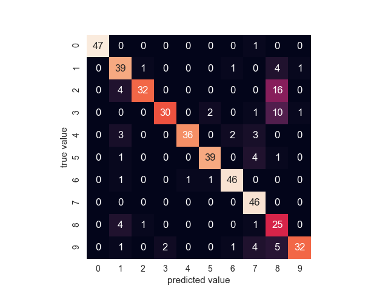

We see where most mistakes get made, let's take a look why these mistakes are made. This code is slightly altered compared to the book. (`y_test.index[i]` inserted instead of `i`)

``` python
fig, ax = plt.subplots(10, 10, figsize = (8,8), subplot_kw = {'xticks' : [], 'yticks' : []}, gridspec_kw = dict(hspace = 0.1, wspace = 0.1))

for i, ax in enumerate(ax.flat):
  ax.imshow(digits.images[y_test.index[i]], cmap = 'binary', interpolation = 'nearest')
  ax.text(0.05, 0.05, str(y_pred[i]), transform = ax.transAxes, color = 'green' if (y_test[y_test.index[i]] == y_pred[i]) else 'red')
```

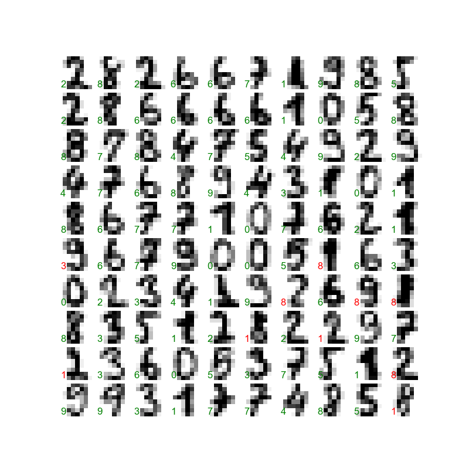

Gives us some good information on where the mistakes are made. We can conclude the mistakes that are being made are quite understandable from an algorithm's perspective.

## Hyperparameters and Model Validation

We've learned that applying a supervised machine learning model, goes like:

1. Choose a class of model
2. Choose model hyperparameters
3. Fit the model to the training data
4. Use the model to predict labels on new data

Here step 3 and 4 are crucial for validating your model. We need to test the model on new data to see if it does well! That's why we always split the entire data set in a training set and a test set. We train the model on the training set and validate the accuracy of the model on the test set.

Slice your data can be done in several ways, and might influence your model validation. There is a very handy way of validating your model by cross validating your training and test set, that is, picking another split between training and test set and computing accuracy scores for each cross validation.

### Example: K-fold cross validation

``` python
from sklearn.datasets import load_iris
iris = load_iris()
X = iris.data
y = iris.target

from sklearn.neighbors import KNeighborsClassifier
model = KNeighborsClassifier()

from sklearn.cross_validation import cross_val_score
scores = cross_val_score(model, X, y, cv=5)
scores
Out[1]: array([0.96666667, 1.        , 0.93333333, 0.96666667, 1.        ])

import numpy as np
np.mean(scores)
Out[5]: 0.9733333333333334
```

Giving us a pretty high accuracy score. So the model seems valid!

## Selecting the Best Model

Now that we've seen the basics of model validation and model cross validation, we'll dive into the curious world of hyperparameters! Picking hyperparameters is highly influential for picking a good model. If we have a bad model we can improve it by selecting another model or tweaking the hyperparameters. We'll try to answer the following question:

"If my estimator is bad, how can we improve it?"

1. Use a more complicated/more flexible model
2. Use a less complicated/less flexible model
3. Gather more training examples
4. Gather more data to add features to each sample

### The Bias Variance Trade Off

Fundamentally, the question of "the best model" is about finding the sweet spot in the trade-off between **bias** and **variance**.

* High-bias model: Underfits the data. Does nog have enough model flexibility to suitably account for all the features in the data.

* High-variance model: Overfits the data. Has to much model flexibility that the model ends up accounting for random errors.

How well a model performs can be measured with the R^2 score, or the coefficient of determination. R^2 = 1 indicates a perfect match, R^2 = 0 indicate the model does no better than simply taking the mean of the data, and negative values mean even worse models.

* For high bias models the performance of the model on the validation set is similar to the performabnce on the training set.

* For high-variance models, the performance of the model on the validation set is far worse than the performance on the training set.

If we have the ability to tune the model complexity, we would expect the training score and validation score to behave as illustrated:

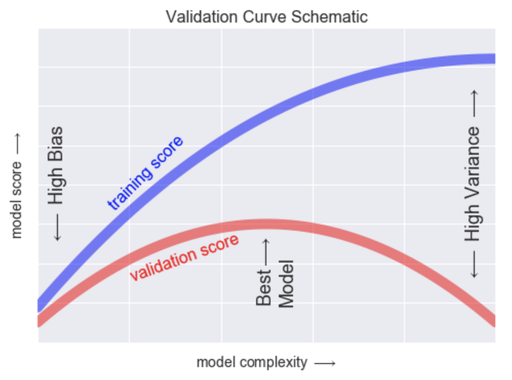

### Validation curves in Scikit-Learn

Let's start of by creating some fake data and trying to fit several polynomial regression models to the data. We'll see soon enough what models will work and what models will fail. Let's take the bias/variance trade-off in to account.

``` python
from sklearn.preprocessing import PolynomialFeatures
from sklearn.linear_model import LinearRegression
from sklearn.pipeline import make_pipeline

def PolynomialRegression(degree = 2, **kwargs):
  make_pipeline(PolynomialFeatures(degree), LinearRegression(**kwargs))

def make_data(N, err = 1.0, rseed = 1):
  rng = np.random.RandomState(rseed)
  X = rng.rand(N, 1) ** 2                   # N random X values squared, so concentrated between [0,1]
  y = 10 - 1./(X.ravel() + 0.1)             # No devision by 0, so values don't blow up. X = 0 -> y=0, X = infinity -> y=10
  if err > 0:                               # error factor added to y.
    y += err + rng.randn(N)
  return X,y

X,y = make_data(40)

matplotlib                                  # using matplotlib backend
import seaborn as sns
sns.set()

X_test = np.linspace(-0.1, 1.1, 500)[:, None]     # We need the data in [500,1] shape for the linear model

plt.scatter(X.ravel(), y, color = 'black')        # We need the data in [40,] shape for plotting
axis = plt.axis()
for degree in [1,2,3]:
  y_test = PolynomialRegression(degree).fit(X,y).predict(X_test)
  plt.plot(X_test.ravel(), y_test, label = 'degree = {0}'.format(degree))
plt.xlim(-1.0, 1.0)
plt.ylim(-2,12)
plt.legend(loc = 'best')
```

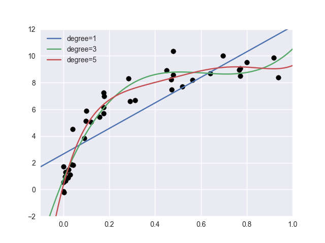

In the image above we see 3 models with a different degree trying to predict the data. From this chart it's not directly clear what model is best. It's probably not the linear model, but the 3rd degree or the 5th degree polynomial good both be a good fit right?

Now to solve this issue we can plot the validation curve of a polynomial model with different degrees.

``` python
from sklearn.learning_curve import validation_curve
degree = np.arange(0,21)
train_score, val_score = validation_curve(PolynomialRegression(), X, y, 'polynomialfeatures__degree', degree, cv = 7)

plt.plot(degree, np.median(train_score), 1), color = 'blue', label = 'training score')
plt.plot(degree, np.median(val_score), 1), color = 'red', label = 'validation score')
plt.legend(loc = 'best')
plt.ylim(0,1)
plt.xlabel('degree')
plt.ylabel('score')
```

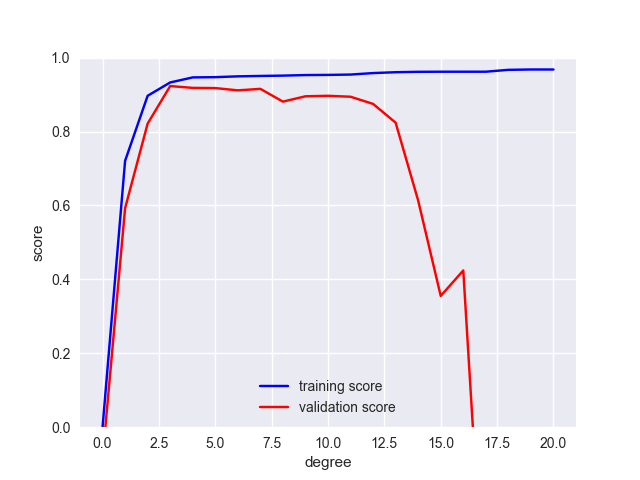

From the image above we can see that the optimal degree for the polynomial is 3. This is because there is a peak in validation score with a polynomial of degree 3.

### Learning Curves

We've seen that hyperparameters are very important in choosing a good model. The model with degree 3 was clearly better than a model with a different degree. We've also stated that there is another factor in creating a good model: 'The amount of data'. The more data we feed into a model, the better the model becomes in making predictions.

``` python
X2,y2 = make_data(200)
plt.scatter(X2.ravel(), y2)
```

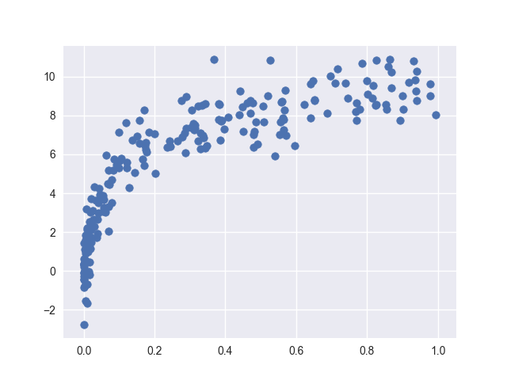

We'll duplicate the preceding code in order to show the difference in learning rates if more data is given.

``` python
degree = np.arange(21)
train_score, val_score = validation_curve(PolynomialRegression(), X, y, 'polynomialfeatures__degree', degree, cv = 7)
train_score2, val_score2 = validation_curve(PolynomialRegression(), X2, y2, 'polynomialfeatures__degree', degree, cv = 7)

plt.plot(degree, np.median(train_score, 1), color = 'blue', linestyle = 'dashed', alpha = 0.3, label = 'training score (N=40)')
plt.plot(degree, np.median(val_score, 1), color = 'red', linestyle = 'dashed', alpha = 0.3, label = 'validation score (N=40)')

plt.plot(degree, np.median(train_score2, 1), color = 'blue', label = 'training score (N=200)')
plt.plot(degree, np.median(val_score2, 1), color = 'red', label = 'validation score (N=200)')
plt.ylim(0,1)
plt.xlim(-0.5, 21,5)
plt.legend(loc = 'best')
plt.xlabel('degree')
plt.ylabel('score')
```

We see that the model complexity doesn't really matter that much anymore if you have enough data. Models are not really overfitting since they have enough reference points! Robust models, yay!

### Learning curves in scikit learn.

So now we know that with more data, models are able to perform a lot better. But how much better is the question? Just like above it's sometimes wise to plot the behaviour of a model with different amounts of data points. These are know as learning curves. In general we expect learning curves to behave a little like this:

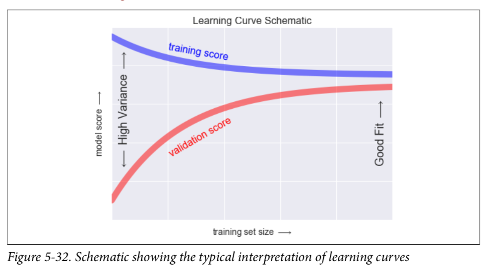

But with scikit learn we're able to plot our own learning curves. This way it's easier to determine how much training data we actually need for a valid model. Let's plot the learning curve for a 2nd and 9th degree polynomial regression model.

``` python
from sklearn learning_curve import learning_curve
fig, ax = plt.subplots(1,2, figsize = (16,6))
fig.subplots_adjust(left = 0.025, right = 0.95, wspace = 0.1)

for i, degree in enumerate([2,9]):
  N, train_lc, val_lc = learning_curve(PolynomialRegression(degree), X, y, cv=7, train_sizes = np.linspace(0.3,1,25))
  ax[i].plot(N, np.mean(train_lc, 1), color = 'blue', label = 'training score')
  ax[i].plot(N, np.mean(val_lc, 1), color = 'red', label = 'validation score')
  ax[i].hlines(np.mean([train_lc[-1], val_lc[-1]]), N[0], N[-1], color = 'gray', linestyle = 'dashed') # Plotting the convergence asymptote
  ax[i].set_xlabel('training size')
  ax[i].set_ylabel('score')
  ax[i].set_ylim(0,1)
  ax[i].set_xlim(N[0], N[-1])
  ax[i].set_title('degree = {0}'.format(degree))
  ax[i].legend(loc = 'best')
```

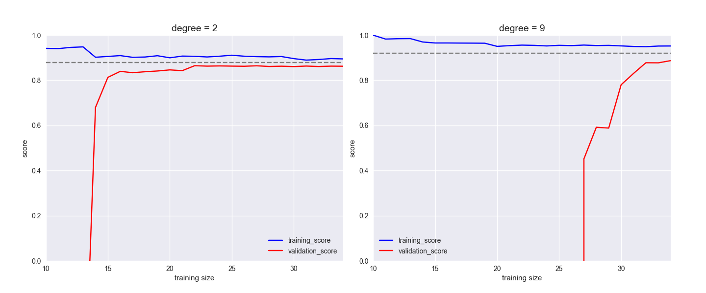
